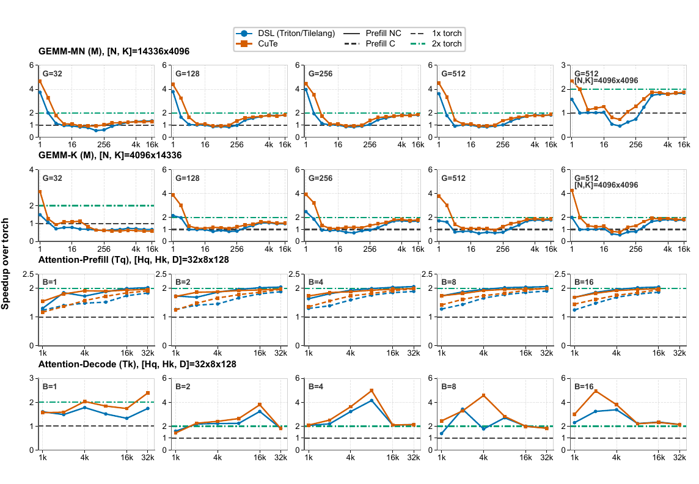
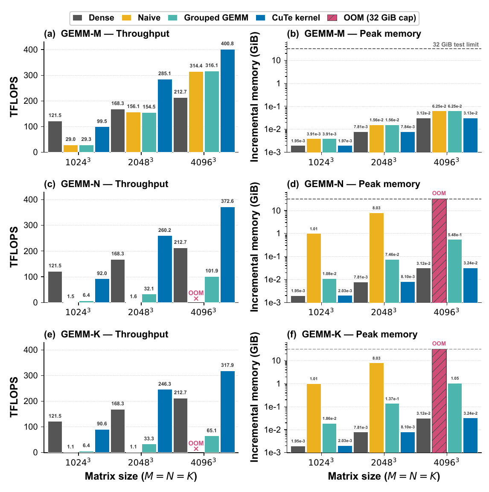

<h1 align="center">DynamicPruningKernels</h1>

<p align="center"><b>A unified CuTe/DSL kernel library for token-wise dynamic pruning</b></p>

<p align="center">
  <a href="https://arxiv.org/abs/2607.28418">Paper</a>
</p>

DynamicPruningKernels is a unified, research-oriented kernel library for token-wise dynamic pruning in Transformer attention and feed-forward layers. It accepts binary routing masks from arbitrary pruning or routing methods, converts them into tile-friendly execution layouts, skips inactive computation without materializing token-specific weights, and dispatches architecture-specific CuTe kernels through a persistent JIT autotuning system from SGLang JIT kernel interface.

The library is independent of the model architecture, router design, training recipe, and serving framework. Its public API exposes a common routing-mask convention across projection, feed-forward, prefill-attention, and decode-attention operators, with PyTorch and DSL implementations available as correctness references and fallback backend.

## Highlights

| Capability | Description |
| --- | --- |
| **Unified operator set** | Output-width GEMM, reduction-width GEMM, prefill attention, and decode attention share one routing-mask and backend-dispatch abstraction. |
| **Fused routing-aware execution** | Reorders masks and skips inactive tiles inside the kernel, avoiding explicit gather-compute-scatter intermediates. |
| **Shape-aware JIT autotuning** | Compiles candidate CuTe configurations in parallel and stores the best configuration in a persistent cache. |
| **Stable dynamic-shape keys** | Buckets token dimensions by their next power of two so nearby sequence lengths reuse tuning and compilation results. |
| **Lazy backend registry** | Selects backend, kernel version, and GPU architecture at runtime without eagerly importing optional dependencies. |

## Operator coverage

Token-wise pruning methods commonly route complete tokens, contiguous FFN channel groups, query-head groups, or combinations of these units. The four kernel families cover the corresponding projection and attention patterns:

| Pruned unit | Typical operator | Kernel family |
| --- | --- | --- |
| Tokens `(M-axis)` | Any projection with inactive token | `gemm_mn` with `G=D_ffn` and `attention` family with `NG=1` |
| Output-channel groups `(N-axis)` | Up/Gate projections or grouped Q projections | `gemm_mn` |
| Input-channel groups `(K-axis)` | Down projections or grouped O projections | `gemm_k` |
| Query tokens or query-head groups | Prefill attention | `attention_prefill` |
| Query-head groups at `Tq=1` | Decode attention | `attention_decode` |

The library consumes an already-produced Boolean routing mask and does not prescribe how it is generated. Masks may come from learned routers, thresholding, structured pruning policies, token-skipping methods, or synthetic benchmark workloads.

## Performance

The following results use Llama-3.1-8B operator shapes, random 50% sparsity, CUDA Graph replay, and an NVIDIA RTX 5090 (`sm120`). Dense GEMM baselines use PyTorch/cuBLAS and attention baselines use PyTorch SDPA (FlashAttention2/FlashDecoding). Reported speedups measure complete operator wall-clock time, including routing-layout preparation where applicable.



The following results are the comparison between naive gather-scatter kernel and optimized CuTe kernels. Naive dynamic-width execution gathers active slices, launches a dense operator, and scatters the result back to the original layout. The fused CuTe kernels avoid these intermediate tensors, thus achieves the best latency and memory efficiency.



## Installation

DynamicPruningKernels requires Linux, Python 3.10 or newer, PyTorch 2.4 or newer, a compatible CUDA toolkit, and an NVIDIA GPU supported by one of the shipped architecture-specific headers.

Install the CuTe JIT implementation from source:

```bash
pip install -e ".[cute]"
```

Install optional reference backends when needed:

```bash
pip install -e ".[cute,tilelang]"
```

The package distribution is named `dynamic-pruning-kernels`. The import path remains `dynamic_width_jit` for compatibility with existing integrations. If an earlier checkout was installed under `dynamic-width-jit-kernel`, uninstall it before installing this package.

Built wheels include the versioned CUDA kernels and vendored compilation headers, so an editable source checkout is not required at runtime.

## Supported kernels

| Kernel family | Pruned dimension | Default | Reference backends |
| --- | --- | --- | --- |
| `gemm_mn` | Output width N; `groups=1` also represents token skipping along M | v1: `sm8x`, `sm12x` | Triton, PyTorch |
| `gemm_k` | Input/reduction width K | v1: `sm8x`, `sm12x` | Triton, PyTorch |
| `attention_prefill` | Query tokens and query-head groups | v3: `sm12x` | Triton, PyTorch |
| `attention_decode` | Query-head groups at `Tq=1` | v0: `sm12x` | TileLang, PyTorch |

`sm8x` denotes NVIDIA compute capability 8.x and `sm12x` denotes compute capability 12.0a. The default versions prioritize the currently validated implementation rather than the highest version number. For `attention` family, current version need TMA to automatically handle OOB, thus do not support `sm8x` yet.

Inspect the installed registry without importing every backend:

```bash
dynamic-pruning-kernels --available
python -m dynamic_width_jit gemm_mn --json
```

The legacy `dynamic-width-kernels` command remains available as an alias.

## Quick start

The public API lazily resolves the selected implementation. CuTe kernels return `(output, metadata)`, while PyTorch and DSL reference backends return the output tensor directly.

```python
import torch
from dynamic_width_jit import run_kernel

# A: [batch, tokens, K]
# weight: [N, K]
# route_mask: [batch, tokens, N // group_size]
A = torch.randn(1, 128, 4096, device="cuda", dtype=torch.float16)
weight = torch.randn(4096, 4096, device="cuda", dtype=torch.float16)
route_mask = torch.rand(1, 128, 32, device="cuda") >= 0.5

output, routing = run_kernel(
    "gemm_mn",
    A,
    weight,
    route_mask,
    backend="cute",        # auto | cute | triton | torch
    version="default",     # default | latest | vN | N
    arch="auto",           # auto | sm8x | sm12x
    autotune=True,
    estimate_sparsity=0.5,
)
```

Resolve a kernel once when it is called repeatedly:

```python
from dynamic_width_jit import get_kernel

down = get_kernel("gemm_k", backend="cute", version="default", arch="auto")
down_output, _ = down(
    intermediate,
    down_weight,
    route_mask,
    sorted_mask=routing["sorted_mask"],
    sorted_indices=routing["sorted_indices"],
    autotune=True,
    estimate_sparsity=0.5,
)
```

Passing `sorted_mask` and `sorted_indices` reuses the routing layout produced by an upstream compatible operator. This is useful when several operators share a routing decision, such as paired Up/Gate projections or a routed attention block followed by its O projection.

### Tensor conventions

| Kernel | Inputs | Routing mask | Output |
| --- | --- | --- | --- |
| `gemm_mn` | `A [B,T,K]`, `weight [N,K]` | `[B,T,N/G]` | `[B,T,N]` |
| `gemm_k` | `A [B,T,K]`, `weight [N,K]` | `[B,T,K/G]` | `[B,T,N]` |
| `attention_prefill` | `Q [B,Tq,Hq,D]`, `K/V [B,Tk,Hk,D]` | `[B,Tq,NG]` | `[B,Tq,Hq,D]` |
| `attention_decode` | Same layout with `Tq=1` | `[B,1,NG]` | `[B,1,Hq,D]` |

Routing masks are Boolean tensors where `True` marks active work. `G` is the contiguous GEMM group size and `NG` is the number of independently routed query-head groups.

## JIT autotuning

Pass `autotune=True` to benchmark the pruned configuration space and cache the best configuration. Pass `autotune=False` to compile a deterministic heuristic configuration without tuning.

Exact token counts change frequently during autoregressive inference. Using them directly in the tuning key would cause excessive compilation and tuning, so dynamic token dimensions are rounded to their next power of two:

| Kernel | Bucketed key |
| --- | --- |
| `gemm_mn`, `gemm_k` | `rM = next_power_of_2(M)` |
| `attention_prefill` | `rTq = next_power_of_2(Tq)`, `rTk = next_power_of_2(Tk)` |
| `attention_decode` | `rTk = next_power_of_2(Tk)` |

Shapes in the same bucket share one tuning record and compiled configuration; exact tensor extents remain runtime values. For example, `M=513` and `M=1000` both use `rM=1024`.

| Environment variable | Default | Purpose |
| --- | --- | --- |
| `JIT_AUTOTUNE_CACHE_DIR` | `~/.cache/jit_kernel/autotune` | Persistent JSON tuning cache |
| `JIT_AUTOTUNE_COMPILE_WORKERS` | `8` | Parallel JIT compilation workers |
| `JIT_AUTOTUNE_VERBOSE` | `1` | Print compilation, best-config, and cache-hit messages |
| `JIT_AUTOTUNE_FORCE_TUNE` | `0` | Remove the tuning cache at import and retune |
| `TVM_FFI_CACHE_DIR` | `~/.cache/tvm-ffi` | Compiled TVM-FFI module cache |
| `JIT_AUTOTUNE_FORCE_RECOMPILE` | `0` | Remove the TVM-FFI cache at import and recompile |
| `CUTE_JIT_CFLAGS` | empty | Additional host compiler flags |
| `CUTE_JIT_CUDA_CFLAGS` | empty | Additional CUDA compiler flags |

The force flags delete their corresponding cache directories. Use isolated cache locations for experiments that should not reuse previous tuning results:

```bash
export JIT_AUTOTUNE_CACHE_DIR=/tmp/dynamic-pruning-autotune
export TVM_FFI_CACHE_DIR=/tmp/dynamic-pruning-tvm-ffi
export JIT_AUTOTUNE_VERBOSE=1
```

## Benchmarking and profiling

`run.py` is the common entry point for correctness checks, throughput measurements, tracing, and profiler launches.

Run one correctness case with the deterministic heuristic:

```bash
python run.py \
  --kernel-family gemm \
  --kernel gemm_mn \
  --kernel-version 1 \
  --arch sm12x \
  --M 128 --N 4096 --K 4096 --G 128 \
  --sparsity 0.5 \
  --autotune false \
  --check-precision true
```

Sweep token counts with autotuning and CUDA Graph replay:

```bash
KERNEL_FAMILY=gemm \
KERNEL=gemm_mn \
M_VALUES="128 256 512 1024" \
N=4096 K=4096 G=128 \
AUTOTUNE=true CUDAGRAPH=true \
bash throughput.sh
```

The main script variables are `PYTHON_BIN`, `KERNEL_FAMILY`, `KERNEL`, `KERNEL_VERSION`, `ARCH`, `DEVICE`, `DTYPE`, `SPARSITY_VALUES`, `M_VALUES`, `N`, `K`, `G`, `B_VALUES`, `TQ_VALUES`, `TK_VALUES`, `HQ`, `HK`, `D`, `NG`, `IS_CAUSAL`, `AUTOTUNE`, and `CUDAGRAPH`.

Profile one configuration with NVIDIA Nsight Compute:

```bash
KERNEL_FAMILY=attention \
KERNEL=attention_decode \
KERNEL_VERSION=0 \
ARCH=sm12x \
B=1 TQ=1 TK=32768 HQ=32 HK=8 D=128 NG=8 \
bash ncu.sh
```

Profiles are written to `ncu_profile/<kernel>/v<version>/<arch>/`.

## Testing

Run CPU/reference and registry tests:

```bash
python -m unittest discover -s tests -p "test_*.py" -v
```

Run the opt-in CUDA smoke suite:

```bash
DYNAMIC_WIDTH_RUN_GPU_TESTS=1 \
python -m unittest discover -s tests -p "test_gpu_smoke.py" -v
```

The GPU suite checks numerical agreement, default-version dispatch, routing metadata reuse, and the shipped architecture/version combinations available on the current device.

## Extending the library

External implementations can be registered lazily:

```python
from dynamic_width_jit import register_kernel

register_kernel(
    "gemm_mn",
    "my_backend",
    "my_package.kernels:gemm_mn",
    variants={0: ("sm8x",), 1: ("sm12x",)},
    default_version=1,
    requires=("my_package",),
    priority=60,
)
```

CuTe variants are discovered from `include/<kernel>/vN/<architecture>.cuh`. Adding a compatible versioned header makes the variant visible to both the source-tree runner and installed registry.

## Repository structure

```text
DynamicPruningKernels/
├── include/        # versioned, architecture-specific CuTe kernels
├── python/         # public API, registry, references, and JIT autotuner
├── tests/          # reference tests and opt-in CUDA smoke tests
├── assets/         # benchmark figures
├── run.py          # correctness and benchmark entry point
├── throughput.sh   # configurable throughput sweep
└── ncu.sh          # Nsight Compute wrapper
```

## Citation

The kernels were introduced with WIDE. If this library is useful in your work, please cite:

```bibtex
@article{hu2026wide,
  title         = {WIDE: Boosting Adaptive LLM Inference via Token-level Dynamic Width Pruning},
  author        = {Hu, Haozhe and Wu, Hao and Yin, Peiran and Han, Chao and Ma, Yunpu and Shen, Xiaoyu},
  year          = {2026},
  eprint        = {2607.28418},
  archivePrefix = {arXiv},
  primaryClass  = {cs.AI}
}
```
